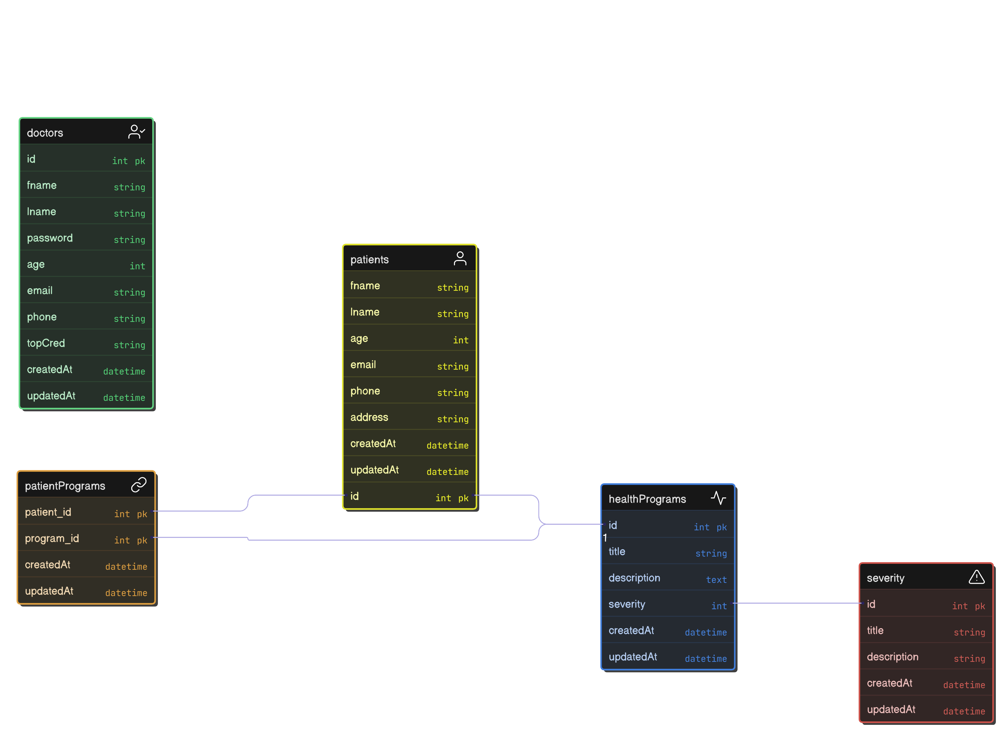

# Health Information System

This project simulates a basic information system  where a doctor can manage patients and health programs. The goal is to implement a RESTFUL API using Flask to handle core functionalities such as creating programs, registering patients, and managing patients enrollments.


## Objectives
- Allow a doctor to:
    - Create health programs
    - Register new Clients
    - Enroll clients in programs
    - Search and view clients profiles
- Expose client profiles via an API for external systems
- Ensure clean, documented, and maintainable code

## Models
1. health Programs
2. patients
3. doctors
4. patientPrograms

### <u>Entity Relation Diagram</u>

<!--  -->



## Installation
 
 ```
 bash

 git clone git@github.com:Walter1G/HealthSystem.git

 ```


 ### To run the server
 Navigate inside the HealthSystem folder
  ```
    cd server
    pip install -r requirements.txt

    flask run
```

  
### run the UI
```

cd ../UI
npm install 
npm run dev

```


